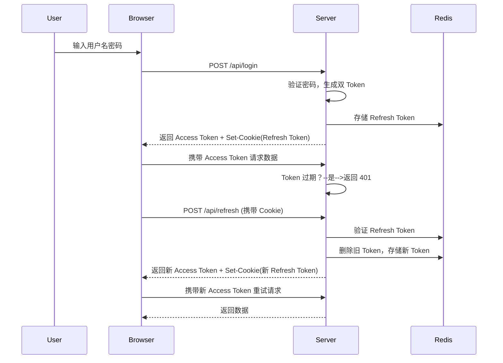

以下是一个**极度详细**且**逐行注释**的示例，涵盖 Node.js 后端与 React 前端的完整实现，重点解释安全设计和业务逻辑。每个关键步骤均附带注释说明。

### **一、后端实现（Node.js + Express）**

#### **1. 依赖安装与配置**

```javascript
// 安装必要依赖
// - express: Web 框架
// - jsonwebtoken: JWT 生成与验证
// - cookie-parser: 解析 Cookie
// - bcryptjs: 密码哈希加密
// - redis: 存储 Refresh Token（需提前安装 Redis 服务）
const express = require('express')
const jwt = require('jsonwebtoken')
const bcrypt = require('bcryptjs')
const crypto = require('crypto')
const { createClient } = require('redis')
const cookieParser = require('cookie-parser')

const app = express()

// 中间件配置
app.use(express.json()) // 解析 JSON 请求体
app.use(cookieParser()) // 解析 Cookie

// 密钥配置（实际应使用环境变量或密钥管理服务）
const ACCESS_TOKEN_SECRET = process.env.ACCESS_TOKEN_SECRET || 'access_secret' // Access Token 签名密钥
const REFRESH_TOKEN_SECRET = process.env.REFRESH_TOKEN_SECRET || 'refresh_secret' // Refresh Token 签名密钥（若使用 JWT 格式）

// 连接 Redis 客户端（存储 Refresh Token）
const redisClient = createClient({
  url: 'redis://localhost:6379', // Redis 服务器地址
})
redisClient.on('error', (err) => console.error('Redis Client Error:', err))
redisClient.connect()
```

#### **2. 用户登录（生成双 Token）**

```javascript
/**
 * POST /api/login
 * 用户登录，生成 Access Token 和 Refresh Token
 */
app.post('/api/login', async (req, res) => {
  const { username, password } = req.body

  //  步骤 1：验证用户身份
  // 模拟数据库查询用户（真实场景需替换为数据库操作）
  const user = await db.getUserByUsername(username)
  if (!user) {
    return res.status(401).json({ error: '用户不存在' })
  }

  // 使用 bcrypt 验证密码哈希
  const isPasswordValid = await bcrypt.compare(password, user.password)
  if (!isPasswordValid) {
    return res.status(401).json({ error: '密码错误' })
  }

  //  步骤 2：生成 Access Token（JWT）
  const accessToken = jwt.sign(
    {
      sub: user.id, // 用户唯一标识（标准声明）
      role: user.role, // 自定义声明：用户角色
      iss: 'api.example.com', // 签发者（可选）
    },
    ACCESS_TOKEN_SECRET,
    { expiresIn: '15m' } // 有效期 15 分钟
  )

  //  步骤 3：生成 Refresh Token（随机字符串 + Redis 存储）
  const refreshToken = crypto.randomBytes(64).toString('hex') // 生成高强度随机字符串

  // 将 Refresh Token 存储到 Redis，关联用户ID和设备信息（可选）
  await redisClient.set(
    `refreshToken:${user.id}:${refreshToken}`, // Key 格式：refreshToken:用户ID:Token值
    JSON.stringify({
      valid: true,
      deviceInfo: req.headers['user-agent'], // 可选：记录设备信息用于安全验证
    }),
    { EX: 7 * 24 * 3600 } // 过期时间：7 天（单位：秒）
  )

  //  步骤 4：返回 Token 到客户端
  // 通过 HttpOnly Cookie 返回 Refresh Token（防XSS）
  res.cookie('refreshToken', refreshToken, {
    httpOnly: true, // 禁止 JavaScript 读取
    secure: true, // 仅通过 HTTPS 传输
    sameSite: 'Strict', // 防 CSRF
    maxAge: 7 * 24 * 3600 * 1000, // 过期时间（毫秒）
    path: '/api/refresh', // 限制 Cookie 仅对刷新接口有效
  })

  // 返回 Access Token（客户端存储到内存）
  res.json({
    accessToken,
    user: { id: user.id, username: user.username }, // 可选：返回用户基本信息
  })
})
```

#### **3. 刷新 Access Token**

```javascript
/**
 * POST /api/refresh
 * 使用 Refresh Token 获取新的 Access Token
 */
app.post('/api/refresh', async (req, res) => {
  //  步骤 1：获取并验证 Refresh Token
  const refreshToken = req.cookies.refreshToken
  if (!refreshToken) {
    return res.status(401).json({ error: '未提供 Refresh Token' })
  }

  // 从 Redis 中验证 Refresh Token 有效性
  const storedTokenData = await redisClient.get(`refreshToken:${user.id}:${refreshToken}`)
  if (!storedTokenData) {
    return res.status(401).json({ error: '无效的 Refresh Token' })
  }

  // 解析存储的 Token 数据（包含设备信息）
  const { valid, deviceInfo } = JSON.parse(storedTokenData)
  if (!valid || deviceInfo !== req.headers['user-agent']) {
    // 设备信息不匹配可能为 Token 盗用
    await redisClient.del(`refreshToken:${user.id}:${refreshToken}`) // 立即失效旧 Token
    return res.status(401).json({ error: '设备验证失败' })
  }

  //  步骤 2：生成新 Access Token
  const newAccessToken = jwt.sign({ sub: user.id, role: user.role }, ACCESS_TOKEN_SECRET, {
    expiresIn: '15m',
  })

  //  步骤 3：滚动刷新 Refresh Token（可选）
  // 生成新 Refresh Token 并替换旧 Token（增强安全性）
  const newRefreshToken = crypto.randomBytes(64).toString('hex')

  // 删除旧 Token
  await redisClient.del(`refreshToken:${user.id}:${refreshToken}`)

  // 存储新 Token
  await redisClient.set(
    `refreshToken:${user.id}:${newRefreshToken}`,
    JSON.stringify({
      valid: true,
      deviceInfo: req.headers['user-agent'],
    }),
    { EX: 7 * 24 * 3600 }
  )

  // 返回新 Token
  res.cookie('refreshToken', newRefreshToken, {
    /* 同上 */
  })
  res.json({ accessToken: newAccessToken })
})
```

#### **4. 注销处理**

```javascript
/**
 * POST /api/logout
 * 注销用户，使 Token 失效
 */
app.post('/api/logout', async (req, res) => {
  const refreshToken = req.cookies.refreshToken
  if (!refreshToken) return res.sendStatus(204) // 无内容

  //  步骤 1：使 Refresh Token 失效
  // 从 Redis 删除 Token
  await redisClient.del(`refreshToken:${user.id}:${refreshToken}`)

  //  步骤 2：清除客户端 Cookie
  res.clearCookie('refreshToken', {
    httpOnly: true,
    secure: true,
    sameSite: 'Strict',
    path: '/api/refresh',
  })

  res.sendStatus(204) // 成功无内容
})
```

### **二、前端实现（React）**

#### **1. 登录页面（存储 Token）**

```jsx
import React, { useState } from 'react';
import axios from 'axios';

const Login = () => {
  const [username, setUsername] = useState('');
  const [password, setPassword] = useState('');

  const handleSubmit = async (e) => {
    e.preventDefault();
    try {
      // 发送登录请求
      const response = await axios.post('/api/login', { username, password });

      // 存储 Access Token 到内存（非持久化）
      sessionStorage.setItem('accessToken', response.data.accessToken); // 页面关闭后清除

      // 存储用户信息到状态管理（如 Redux 或 Context）
      setCurrentUser(response.data.user);

    } catch (error) {
      console.error('登录失败:', error.response?.data?.error || '未知错误');
    }
  };

  return (
    /* 表单 UI */
  );
};
```

#### **2. 请求拦截器（自动刷新 Token）**

```javascript
// 创建 Axios 实例
const api = axios.create({
  baseURL: '/api',
  withCredentials: true, // 允许携带 Cookie（用于 Refresh Token）
})

// 请求拦截器：添加 Access Token
api.interceptors.request.use((config) => {
  const accessToken = sessionStorage.getItem('accessToken')
  if (accessToken) {
    config.headers.Authorization = `Bearer ${accessToken}` // JWT 标准格式
  }
  return config
})

// 响应拦截器：处理 401 错误
api.interceptors.response.use(
  (response) => response,
  async (error) => {
    const originalRequest = error.config

    // 如果是 401 错误且未重试过
    if (error.response?.status === 401 && !originalRequest._retry) {
      originalRequest._retry = true // 标记为已重试

      try {
        // 发送刷新 Token 请求
        const refreshResponse = await axios.post('/api/refresh', {}, { withCredentials: true })

        // 存储新 Access Token
        sessionStorage.setItem('accessToken', refreshResponse.data.accessToken)

        // 修改原请求的 Authorization 头
        originalRequest.headers.Authorization = `Bearer ${refreshResponse.data.accessToken}`

        // 重新发送原请求
        return api(originalRequest)
      } catch (refreshError) {
        // 刷新失败：跳转到登录页
        sessionStorage.removeItem('accessToken')
        window.location.href = '/login'
        return Promise.reject(refreshError)
      }
    }

    return Promise.reject(error)
  }
)
```

### **三、安全增强措施详解**

#### **1. 防御 XSS（跨站脚本攻击）**

- **Access Token 存储**：使用 `sessionStorage` 而非 `localStorage`，页面关闭后自动清除。
- **Refresh Token 存储**：通过 `HttpOnly` Cookie 防止 JavaScript 读取。
- **输入过滤**：对用户提交的 username/password 进行合法性校验。

#### **2. 防御 CSRF（跨站请求伪造）**

- **SameSite Cookie**：设置 `sameSite: 'Strict'`，禁止跨站请求携带 Cookie。
- **CSRF Token**：敏感操作（如修改密码）要求附加 CSRF Token。

#### **3. Token 泄露应对**

- **短期有效期**：Access Token 15 分钟过期，减少泄露后的风险窗口。
- **设备绑定**：Refresh Token 存储时记录 User-Agent/IP，验证一致性。
- **黑名单机制**：注销时立即将 Refresh Token 标记为无效。

#### **4. 加密与签名**

- **JWT 签名**：使用 HMAC SHA256 或 RSA 算法确保 Token 完整性。
- **密码哈希**：使用 bcrypt 存储用户密码（盐值 + 多次哈希）。

### **四、完整流程图**


